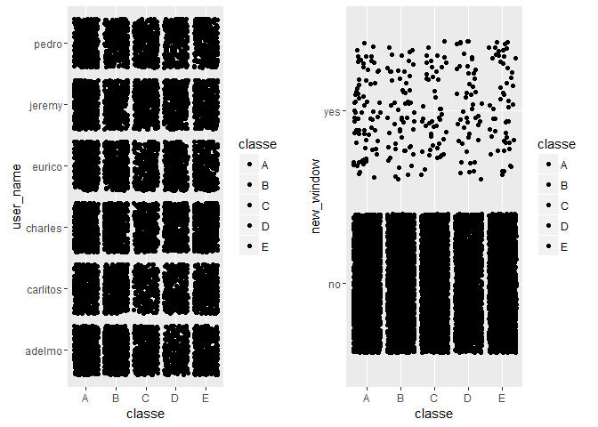
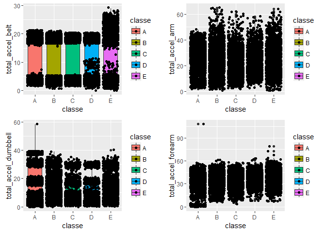

# Predicting Manner of Exercise Using Human Activity Recognition Devices
JGG  
March 20, 2017  


##Background and Data Source


In this project, we will use training and test data sets from the website  http://groupware.les.inf.puc-rio.br/har.  

As described in the website, *six young health participants were asked to perform one set of 10 repetitions of the Unilateral Dumbbell Biceps Curl in five different fashions: exactly according to the specification (Class A), throwing the elbows to the front (Class B), lifting the dumbbell only halfway (Class C), lowering the dumbbell only halfway (Class D) and throwing the hips to the front (Class E).*

So, our goal is to predict the manner in which the six participants did the exercise. This is the "classe" variable in the training set.  The following predictors were used initially: "user_name", "new_window", "total_accel_belt", "total_accel_arm", "total_accel_dumbbell", "total_accel_forearm."  However, additional predictors were considered in the final model to increase accuracy.


##Loading and Processing the Data


```r
library(caret)
library(kernlab)
library(ggplot2)
library(gridExtra)
```


```r
pml = read.csv("pml-training.csv") 
	##to be divided into training and validation data sets	
testing = read.csv("pml-testing.csv")
dim(pml)
```

```
## [1] 19622   160
```

```r
dim(testing)
```

```
## [1]  20 160
```


####Create training and validation data sets


```r
set.seed(1)
inBuild = createDataPartition(y=pml$classe, p=0.6, list=FALSE)
validation = pml[-inBuild,]
buildData = pml[inBuild,]

set.seed(1)
inTrain = createDataPartition(y=buildData$classe, p=1.0, list=FALSE)
training = buildData[inTrain,]
dim(training)
```

```
## [1] 11776   160
```

```r
dim(validation)
```

```
## [1] 7846  160
```

```r
dim(testing)
```

```
## [1]  20 160
```

##Exploratory Data Analysis


```r
table(training$classe)
```

```
## 
##    A    B    C    D    E 
## 3348 2279 2054 1930 2165
```

```r
table(training$user_name,training$classe)
```

```
##           
##              A   B   C   D   E
##   adelmo   704 450 469 314 417
##   carlitos 490 422 265 287 368
##   charles  539 461 320 383 423
##   eurico   525 365 287 349 319
##   jeremy   699 298 414 326 337
##   pedro    391 283 299 271 301
```

```r
table(training$new_window,training$classe)
```

```
##      
##          A    B    C    D    E
##   no  3277 2224 2006 1882 2113
##   yes   71   55   48   48   52
```

```r
summary(training$total_accel_belt)
```

```
##    Min. 1st Qu.  Median    Mean 3rd Qu.    Max. 
##    0.00    3.00   17.00   11.32   18.00   29.00
```

```r
summary(training$total_accel_arm)
```

```
##    Min. 1st Qu.  Median    Mean 3rd Qu.    Max. 
##    1.00   17.00   27.00   25.56   33.00   65.00
```

```r
summary(training$total_accel_dumbbell)
```

```
##    Min. 1st Qu.  Median    Mean 3rd Qu.    Max. 
##    0.00    5.00   11.00   13.82   20.00   58.00
```

```r
summary(training$total_accel_forearm)
```

```
##    Min. 1st Qu.  Median    Mean 3rd Qu.    Max. 
##     0.0    29.0    36.0    34.8    41.0   108.0
```


####Boxplot of "classe" variable versus predictors

<!-- -->

<!-- -->


From the plot above, we can observe large number of dots in each different boxes and so, it suggests that trend, if any, may be true.  


##Prediction Models

**Prediction with trees** and **model-based prediction** will be used for convenience.   


###A. Predicting with Trees


```r
set.seed(1)
mod1 = train(classe ~ user_name + new_window+ total_accel_belt + 
			total_accel_arm + total_accel_dumbbell + total_accel_forearm, 
		method="rpart", data=training)
print(mod1$finalModel)
```

```
## n= 11776 
## 
## node), split, n, loss, yval, (yprob)
##       * denotes terminal node
## 
##   1) root 11776 8428 A (0.28 0.19 0.17 0.16 0.18)  
##     2) total_accel_belt< 21.5 11271 7923 A (0.3 0.2 0.18 0.17 0.15)  
##       4) total_accel_dumbbell>=29.5 1385  626 A (0.55 0.14 0.074 0.11 0.12) *
##       5) total_accel_dumbbell< 29.5 9886 7297 A (0.26 0.21 0.2 0.18 0.15)  
##        10) total_accel_dumbbell< 4.5 2826 1648 A (0.42 0.12 0.14 0.23 0.095) *
##        11) total_accel_dumbbell>=4.5 7060 5325 B (0.2 0.25 0.22 0.16 0.17)  
##          22) total_accel_belt>=3.5 5639 4243 C (0.23 0.21 0.25 0.18 0.13)  
##            44) user_nameeurico< 0.5 5481 4085 C (0.24 0.21 0.25 0.16 0.13)  
##              88) user_namecharles< 0.5 4504 3263 A (0.28 0.19 0.24 0.17 0.13) *
##              89) user_namecharles>=0.5 977  645 B (0.077 0.34 0.33 0.12 0.14)  
##               178) total_accel_dumbbell>=8.5 269   63 B (0 0.77 0.015 0 0.22) *
##               179) total_accel_dumbbell< 8.5 708  394 C (0.11 0.18 0.44 0.16 0.11) *
##            45) user_nameeurico>=0.5 158   23 D (0 0.032 0 0.85 0.11) *
##          23) total_accel_belt< 3.5 1421  869 B (0.067 0.39 0.12 0.086 0.34) *
##     3) total_accel_belt>=21.5 505    0 E (0 0 0 0 1) *
```

####Measure accuracy of mod1 in the training set


```r
prediction1 = predict(mod1, newdata=training)
result1 = confusionMatrix(prediction1, training$classe)
result1
```

```
## Confusion Matrix and Statistics
## 
##           Reference
## Prediction    A    B    C    D    E
##          A 3178 1390 1564 1560 1023
##          B   95  758  176  122  539
##          C   75  126  314  113   80
##          D    0    5    0  135   18
##          E    0    0    0    0  505
## 
## Overall Statistics
##                                           
##                Accuracy : 0.4153          
##                  95% CI : (0.4063, 0.4242)
##     No Information Rate : 0.2843          
##     P-Value [Acc > NIR] : < 2.2e-16       
##                                           
##                   Kappa : 0.2111          
##  Mcnemar's Test P-Value : < 2.2e-16       
## 
## Statistics by Class:
## 
##                      Class: A Class: B Class: C Class: D Class: E
## Sensitivity            0.9492  0.33260  0.15287  0.06995  0.23326
## Specificity            0.3430  0.90186  0.95947  0.99766  1.00000
## Pos Pred Value         0.3647  0.44852  0.44350  0.85443  1.00000
## Neg Pred Value         0.9445  0.84920  0.84279  0.84550  0.85272
## Prevalence             0.2843  0.19353  0.17442  0.16389  0.18385
## Detection Rate         0.2699  0.06437  0.02666  0.01146  0.04288
## Detection Prevalence   0.7401  0.14351  0.06012  0.01342  0.04288
## Balanced Accuracy      0.6461  0.61723  0.55617  0.53381  0.61663
```

Accuracy of mod1 in the training set is only 42%.

####Measure accuracy of mod1 in the validation set


```r
prediction2 = predict(mod1, newdata=validation)
result2 = confusionMatrix(prediction2, validation$classe)
result2
```

```
## Confusion Matrix and Statistics
## 
##           Reference
## Prediction    A    B    C    D    E
##          A 2111  948 1040 1032  660
##          B   63  504  112   97  369
##          C   58   64  216   78   56
##          D    0    2    0   79   18
##          E    0    0    0    0  339
## 
## Overall Statistics
##                                           
##                Accuracy : 0.4141          
##                  95% CI : (0.4032, 0.4251)
##     No Information Rate : 0.2845          
##     P-Value [Acc > NIR] : < 2.2e-16       
##                                           
##                   Kappa : 0.2096          
##  Mcnemar's Test P-Value : < 2.2e-16       
## 
## Statistics by Class:
## 
##                      Class: A Class: B Class: C Class: D Class: E
## Sensitivity            0.9458  0.33202  0.15789  0.06143  0.23509
## Specificity            0.3445  0.89870  0.96048  0.99695  1.00000
## Pos Pred Value         0.3645  0.44017  0.45763  0.79798  1.00000
## Neg Pred Value         0.9411  0.84868  0.84378  0.84420  0.85307
## Prevalence             0.2845  0.19347  0.17436  0.16391  0.18379
## Detection Rate         0.2691  0.06424  0.02753  0.01007  0.04321
## Detection Prevalence   0.7381  0.14593  0.06016  0.01262  0.04321
## Balanced Accuracy      0.6451  0.61536  0.55919  0.52919  0.61755
```

Accuracy of mod1 in the validation set is only 41%.

####Predict test set using mod1


```r
test.prediction1 = predict(mod1, testing)
table(test.prediction1)
```

```
## test.prediction1
##  A  B  C  D  E 
## 17  3  0  0  0
```

We cannot validate the accuracy in test set since there is no "classe" variable.


###B. Model-based Prediction

####B.1 Linear Discriminant Analysis (LDA)


```r
set.seed(1)
modLDA = train(classe ~ user_name + new_window+ total_accel_belt + 
			total_accel_arm + total_accel_dumbbell + total_accel_forearm,
		method="lda", data=training)
predictLDA_val = predict(modLDA, validation)
round(table(predictLDA_val,validation$classe)/length(validation$classe),2)
```

```
##               
## predictLDA_val    A    B    C    D    E
##              A 0.21 0.11 0.12 0.10 0.06
##              B 0.02 0.04 0.01 0.00 0.02
##              C 0.01 0.01 0.02 0.02 0.01
##              D 0.04 0.02 0.03 0.04 0.02
##              E 0.01 0.01 0.00 0.01 0.07
```

```r
    ##to measure the accuracy
```

Accuracy of modLDA in the validation set is 38% (that is, 0.21+0.04+0.02+0.04+0.07)

####B.2 Naive Bayes (NB)


```r
set.seed(1)
modNB = train(classe ~ user_name + new_window+ total_accel_belt + 
			total_accel_arm + total_accel_dumbbell + total_accel_forearm, 
		method="nb", data=training)
predictNB_val = predict(modNB, validation)
round(table(predictNB_val,validation$classe)/length(validation$classe),2)
```

```
##              
## predictNB_val    A    B    C    D    E
##             A 0.24 0.10 0.12 0.11 0.08
##             B 0.02 0.07 0.03 0.02 0.03
##             C 0.02 0.02 0.03 0.02 0.01
##             D 0.00 0.00 0.00 0.02 0.00
##             E 0.00 0.00 0.00 0.00 0.06
```

Accuracy of modLDA in the validation set is 42%.

####predict and compare results in the validation set


```r
table(predictLDA_val, predictNB_val)
```

```
##               predictNB_val
## predictLDA_val    A    B    C    D    E
##              A 3645  744  233   59   57
##              B  362  368   28   11   31
##              C   96  104  231   14   23
##              D  763   59  142  116   21
##              E  185   73   29   53  399
```

```r
equalPredictions_val = (predictLDA_val == predictNB_val)
round(table(equalPredictions_val)/nrow(validation),2)
```

```
## equalPredictions_val
## FALSE  TRUE 
##  0.39  0.61
```

Prediction results show that modLDA and modNB agreed 61% of the time in the validation set.


####predict and compare results in the test set


```
##                predictNB_test
## predictLDA_test  A  B  C  D  E
##               A 11  3  1  0  0
##               B  0  0  0  0  0
##               C  0  0  0  0  0
##               D  2  0  2  0  0
##               E  0  1  0  0  0
```

```
## equalPredictions_test
## FALSE  TRUE 
##  0.45  0.55
```

Prediction results show that modLDA and modNB agreed 55% of the time in the test set.

####OBSERVATION

Though accuracy measures in the the models above are low (below 50%), results are consistent.  Increasing the number of predictors may also increase the Accuracy of the models.


##FINAL MODEL


For the final model, LDA with incrased number of predictors will be used for convenience and speed of running the model.


###LDA with increased number of predictors


```r
set.seed(1)
modLDA2 = train(classe ~ user_name + new_window+ total_accel_belt + 
			total_accel_arm + total_accel_dumbbell + total_accel_forearm+
			num_window + roll_belt + pitch_belt + yaw_belt+
			roll_arm + pitch_arm + yaw_arm+
			roll_dumbbell + pitch_dumbbell + yaw_dumbbell+
	 		roll_forearm + pitch_forearm + yaw_forearm +
			gyros_belt_x + gyros_belt_y + gyros_belt_z + 
			accel_belt_x + accel_belt_y + accel_belt_z +
			magnet_belt_x + magnet_belt_y + magnet_belt_z +
			gyros_arm_x + gyros_arm_y + gyros_arm_z + 
			accel_arm_x + accel_arm_y + accel_arm_z +
                  magnet_arm_x + magnet_arm_y + magnet_arm_z +
			gyros_dumbbell_x + gyros_dumbbell_y + gyros_dumbbell_z +
			accel_dumbbell_x + accel_dumbbell_y + accel_dumbbell_z +
			magnet_dumbbell_x + magnet_dumbbell_y + magnet_dumbbell_z + 
			gyros_forearm_x + gyros_forearm_y + gyros_forearm_z +
			accel_forearm_x + accel_forearm_y + accel_forearm_z + 
 			magnet_forearm_x + magnet_forearm_y + magnet_forearm_z, 
		method="lda", data=training)
predictLDA_val2 = predict(modLDA2, validation)
round(table(predictLDA_val2,validation$classe)/length(validation$classe),2)
```

```
##                
## predictLDA_val2    A    B    C    D    E
##               A 0.24 0.03 0.02 0.01 0.01
##               B 0.01 0.13 0.01 0.01 0.02
##               C 0.02 0.03 0.12 0.02 0.01
##               D 0.02 0.01 0.02 0.12 0.02
##               E 0.00 0.01 0.00 0.00 0.13
```


Accuracy of modLDA2 in the validation set is now 74%.


####predict test set using modLDA2


```r
predictLDA_test = predict(modLDA2, testing)
predictLDA_test
```

```
##  [1] C A B A A C D D A A D A B A B A A B B B
## Levels: A B C D E
```
