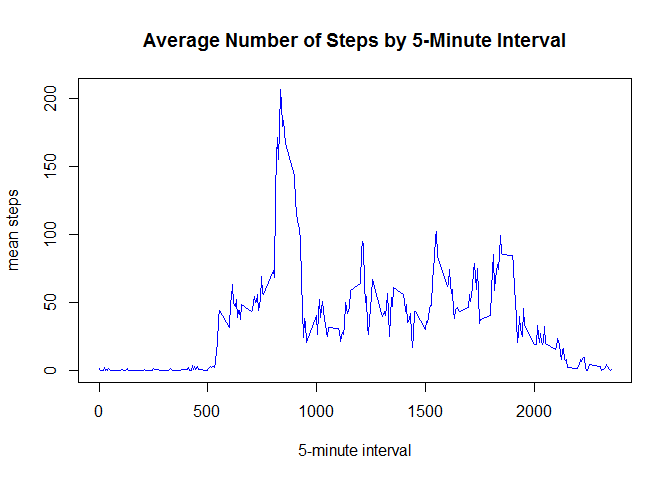

# Reproducible_Research_Programming_Assignment 1
JGGomez  
December 12, 2016  
==============================================================================

### Number 1: Code for reading in the dataset and/or processing the data


```r
setwd("C:/Users/jggomez/Desktop/Data Science/Course 5/Week2")
activity <- read.csv("activity.csv",na.strings = "NA")
activity$date <- as.POSIXct(strptime(x = as.character(activity$date),
       format = "%Y-%m-%d"))
str(activity)
```

```
## 'data.frame':	17568 obs. of  3 variables:
##  $ steps   : int  NA NA NA NA NA NA NA NA NA NA ...
##  $ date    : POSIXct, format: "2012-10-01" "2012-10-01" ...
##  $ interval: int  0 5 10 15 20 25 30 35 40 45 ...
```


### Number 2: Histogram of the total number of steps taken each day


```r
library(plyr)
TotalSteps=ddply(activity,~date,summarise,TotalSteps=sum(steps,na.rm=TRUE))
head(TotalSteps)
```

```
##         date TotalSteps
## 1 2012-10-01          0
## 2 2012-10-02        126
## 3 2012-10-03      11352
## 4 2012-10-04      12116
## 5 2012-10-05      13294
## 6 2012-10-06      15420
```

```r
range=range(TotalSteps$TotalSteps)
	breaks = seq(0,max(range)+5000, by=5000)
	TotalSteps.cut = cut(TotalSteps$TotalSteps, breaks, right=FALSE)
	TotalSteps.freq = table(TotalSteps.cut)
	y=max(TotalSteps.freq) ##to be set as limit of y-axis
hist(TotalSteps$TotalSteps,col="green",breaks=seq(0,max(range)+5000, by=5000),
	main = "Histogram of Total Number of Steps Taken per Day",
	xlab="Total Number of Steps Taken per Day",ylim=c(0,y+5))
```

<!-- -->


### Number 3: Mean and median number of steps taken each day


```r
MeanMedianPerDay=ddply(activity,~date,summarise, 
	MeanSteps=mean(steps,na.rm=TRUE),MedianSteps=median(steps,na.rm=TRUE))
head(MeanMedianPerDay)
```

```
##         date MeanSteps MedianSteps
## 1 2012-10-01       NaN          NA
## 2 2012-10-02   0.43750           0
## 3 2012-10-03  39.41667           0
## 4 2012-10-04  42.06944           0
## 5 2012-10-05  46.15972           0
## 6 2012-10-06  53.54167           0
```

```r
tail(MeanMedianPerDay)
```

```
##          date MeanSteps MedianSteps
## 56 2012-11-25  41.09028           0
## 57 2012-11-26  38.75694           0
## 58 2012-11-27  47.38194           0
## 59 2012-11-28  35.35764           0
## 60 2012-11-29  24.46875           0
## 61 2012-11-30       NaN          NA
```

```r
summary(MeanMedianPerDay)
```

```
##       date              MeanSteps        MedianSteps
##  Min.   :2012-10-01   Min.   : 0.1424   Min.   :0   
##  1st Qu.:2012-10-16   1st Qu.:30.6979   1st Qu.:0   
##  Median :2012-10-31   Median :37.3785   Median :0   
##  Mean   :2012-10-31   Mean   :37.3826   Mean   :0   
##  3rd Qu.:2012-11-15   3rd Qu.:46.1597   3rd Qu.:0   
##  Max.   :2012-11-30   Max.   :73.5903   Max.   :0   
##                       NA's   :8         NA's   :8
```


### Number 4: Time series plot of the average number of steps taken


Set the 5-minute interval as x-axis and the average number of steps taken,averaged across all days, as y-axis.


```r
MeanPerInterval=ddply(activity,~interval,summarise,
	  MeanSteps=mean(steps,na.rm=TRUE))
x=max(MeanPerInterval$interval)
y=max(MeanPerInterval$MeanSteps)
plot(MeanPerInterval$interval,MeanPerInterval$MeanSteps,type="l",col="blue",
	xlim=c(0,x), ylim=c(0,y), 
	main="Average Number of Steps by 5-Minute Interval",
	xlab="5-minute interval",ylab="mean steps")
```

<!-- -->


### Number 5: The 5-minute interval that, on average, contains the maximum number of steps


Which 5-minute interval, on average across all the days in the dataset, 
contains the maximum number of steps?


```r
y = which.max(MeanPerInterval[,2] )
Interval_with_maximum_number_of_steps <- MeanPerInterval[y,1]
Interval_with_maximum_number_of_steps
```

```
## [1] 835
```


*835, 5-minute interval contains the maximum number of steps.*


### Number 6: Code to describe and show a strategy for imputing missing data


Count the total number of missing values in the dataset (i.e. the total number of rows with NAs) and its percentage to the total observations.


```r
summary(activity$steps)
```

```
##    Min. 1st Qu.  Median    Mean 3rd Qu.    Max.    NA's 
##    0.00    0.00    0.00   37.38   12.00  806.00    2304
```

```r
NATable=count(activity$steps=="NA")
NACount=NATable[2,2]
NACount
```

```
## [1] 2304
```

```r
RatioNA=mean(is.na(activity$steps))
RatioNA
```

```
## [1] 0.1311475
```


*There are 2304 missing values under steps corresponding to 0.1311475 of the total observations.*


Fill in the missing values by the mean number of steps for the corresponding 5-minute interval.


Create a new dataset that is equal to the original dataset but with the missing data filled in.


```r
activityNew <- read.csv("activity.csv",na.strings = "NA")
activityNew$date <- as.POSIXct(strptime(x = as.character(activityNew$date),
       format = "%Y-%m-%d"))
activityNew$steps <- ifelse(is.na(activityNew$steps) == TRUE, 
		MeanPerInterval$MeanSteps
		[MeanPerInterval$interval %in% activityNew$interval], 
		activityNew$steps)  
head(activity)
```

```
##   steps       date interval
## 1    NA 2012-10-01        0
## 2    NA 2012-10-01        5
## 3    NA 2012-10-01       10
## 4    NA 2012-10-01       15
## 5    NA 2012-10-01       20
## 6    NA 2012-10-01       25
```

```r
head(activityNew)
```

```
##       steps       date interval
## 1 1.7169811 2012-10-01        0
## 2 0.3396226 2012-10-01        5
## 3 0.1320755 2012-10-01       10
## 4 0.1509434 2012-10-01       15
## 5 0.0754717 2012-10-01       20
## 6 2.0943396 2012-10-01       25
```


### Number 7: Histogram of the total number of steps taken each day after missing values are imputed


For the histogram of the total number of steps taken each day using the new dataset: 


```r
TotalStepsNew=ddply(activityNew,~date,summarise,
	TotalSteps=sum(steps,na.rm=TRUE))
head(TotalStepsNew)
```

```
##         date TotalSteps
## 1 2012-10-01   10766.19
## 2 2012-10-02     126.00
## 3 2012-10-03   11352.00
## 4 2012-10-04   12116.00
## 5 2012-10-05   13294.00
## 6 2012-10-06   15420.00
```

```r
range=range(TotalStepsNew$TotalSteps)
	breaks = seq(0,max(range)+5000, by=5000)
	TotalSteps.cut = cut(TotalStepsNew$TotalSteps, breaks, right=FALSE)
	TotalSteps.freq = table(TotalSteps.cut)
	y=max(TotalSteps.freq) ##to be set as limit of y-axis
hist(TotalStepsNew$TotalSteps,col="green",breaks=seq(0,max(range)+5000, by=5000),
	main ="Histogram of Total Number of Steps Taken per Day",
	sub="missing values were filled in by the mean for the 5-minute interval",
	xlab="Total Number of Steps Taken per Day",ylim=c(0,y+5))
```

<!-- -->


Mean and median of the total number of steps taken per day of the new dataset 


```r
MeanMedianPerDayNew=ddply(activityNew,~date,summarise, 
	MeanSteps=mean(steps,na.rm=TRUE),MedianSteps=median(steps,na.rm=TRUE))
```


Compare values from the estimates from the first part of the assignment.


```r
summary(MeanMedianPerDay)
```

```
##       date              MeanSteps        MedianSteps
##  Min.   :2012-10-01   Min.   : 0.1424   Min.   :0   
##  1st Qu.:2012-10-16   1st Qu.:30.6979   1st Qu.:0   
##  Median :2012-10-31   Median :37.3785   Median :0   
##  Mean   :2012-10-31   Mean   :37.3826   Mean   :0   
##  3rd Qu.:2012-11-15   3rd Qu.:46.1597   3rd Qu.:0   
##  Max.   :2012-11-30   Max.   :73.5903   Max.   :0   
##                       NA's   :8         NA's   :8
```

```r
summary(MeanMedianPerDayNew)
```

```
##       date              MeanSteps        MedianSteps    
##  Min.   :2012-10-01   Min.   : 0.1424   Min.   : 0.000  
##  1st Qu.:2012-10-16   1st Qu.:34.0938   1st Qu.: 0.000  
##  Median :2012-10-31   Median :37.3826   Median : 0.000  
##  Mean   :2012-10-31   Mean   :37.3826   Mean   : 4.474  
##  3rd Qu.:2012-11-15   3rd Qu.:44.4826   3rd Qu.: 0.000  
##  Max.   :2012-11-30   Max.   :73.5903   Max.   :34.113
```


Effect of imputing the mean to the missing data is shown below:


```r
summary(TotalSteps)
```

```
##       date              TotalSteps   
##  Min.   :2012-10-01   Min.   :    0  
##  1st Qu.:2012-10-16   1st Qu.: 6778  
##  Median :2012-10-31   Median :10395  
##  Mean   :2012-10-31   Mean   : 9354  
##  3rd Qu.:2012-11-15   3rd Qu.:12811  
##  Max.   :2012-11-30   Max.   :21194
```

```r
summary(TotalStepsNew)
```

```
##       date              TotalSteps   
##  Min.   :2012-10-01   Min.   :   41  
##  1st Qu.:2012-10-16   1st Qu.: 9819  
##  Median :2012-10-31   Median :10766  
##  Mean   :2012-10-31   Mean   :10766  
##  3rd Qu.:2012-11-15   3rd Qu.:12811  
##  Max.   :2012-11-30   Max.   :21194
```

```r
par(mfcol=c(1,2),mar=c(4,4,2,2))
range=range(TotalSteps$TotalSteps)
	breaks = seq(0,max(range)+5000, by=5000)
	TotalSteps.cut1 = cut(TotalSteps$TotalSteps, breaks, right=FALSE)
	TotalSteps.freq1 = table(TotalSteps.cut1)
	y1=max(TotalSteps.freq1) 
range=range(TotalStepsNew$TotalSteps)
	breaks = seq(0,max(range)+5000, by=5000)
	TotalSteps.cut2 = cut(TotalStepsNew$TotalSteps, breaks, right=FALSE)
	TotalSteps.freq2 = table(TotalSteps.cut2)
	y2=max(TotalSteps.freq2) 
y=max(y1,y2) ##to be set as limit of y-axis
hist(TotalSteps$TotalSteps,col="green",breaks=seq(0,max(range)+5000, by=5000),
	main = "Histogram-Initial",xlab="Total Number of Steps Taken per Day",
	ylim=c(0,y+5),cex.lab=0.7)
hist(TotalStepsNew$TotalSteps,col="green",breaks=seq(0,max(range)+5000, by=5000),
	sub="missing values were filled in by the mean for the 5-minute interval",
	main="Histogram-New", xlab="Total Number of Steps Taken per Day",
	ylim=c(0,y+5),cex.lab=0.7)
```

<!-- -->


### Number 8: Panel plot comparing the average number of steps taken per 5-minute interval across weekdays and weekends


Dataset with the filled-in missing values will be used for this part.
Create a new factor variable in the dataset with two levels - "weekday" and "weekend" indicating whether a given date is a weekday or weekend day.


```r
library(dplyr)
```

```
## 
## Attaching package: 'dplyr'
```

```
## The following objects are masked from 'package:plyr':
## 
##     arrange, count, desc, failwith, id, mutate, rename, summarise,
##     summarize
```

```
## The following objects are masked from 'package:stats':
## 
##     filter, lag
```

```
## The following objects are masked from 'package:base':
## 
##     intersect, setdiff, setequal, union
```

```r
activityNew<-mutate(activityNew,day=weekdays(activityNew$date))
WeekendData = filter(activityNew,day == "Saturday"|day == "Sunday")
WeekdayData = filter(activityNew,day == "Monday"|day == "Tuesday"|
	day=="Wednesday"|day=="Thursday"|day=="Friday")
WeekendData$DayType=as.factor("weekend")
WeekdayData$DayType=as.factor("weekday")
activityNewDayType=rbind(WeekendData,WeekdayData)
str(activityNewDayType)
```

```
## 'data.frame':	17568 obs. of  5 variables:
##  $ steps   : num  0 0 0 0 0 0 0 0 0 0 ...
##  $ date    : POSIXct, format: "2012-10-06" "2012-10-06" ...
##  $ interval: int  0 5 10 15 20 25 30 35 40 45 ...
##  $ day     : chr  "Saturday" "Saturday" "Saturday" "Saturday" ...
##  $ DayType : Factor w/ 2 levels "weekend","weekday": 1 1 1 1 1 1 1 1 1 1 ...
```


Make a panel plot containing a time series plot (i.e. type = "l") of the 5-minute interval (x-axis) and the average number of steps taken, averaged across all weekday days or weekend days (y-axis). 


```r
MeanWeekend=ddply(WeekendData,~interval,summarise,
	MeanSteps=mean(steps,na.rm=TRUE))
MeanWeekday=ddply(WeekdayData,~interval,summarise,
	MeanSteps=mean(steps,na.rm=TRUE))
y=max(max(MeanWeekend$MeanSteps),max(MeanWeekday$MeanSteps))
		## to be set as limit of y-axis
par(mfcol=c(2,1),mar=c(5,4,2,2))
plot(MeanWeekend$interval,MeanWeekend$MeanSteps,type="l",col="blue",
	ylim=c(0,y), main="Average Number of Steps by 5-Minute Interval",
	sub="WEEKEND",xlab="5-minute interval",ylab="mean steps",cex.lab=0.8,
	cex.main=0.7,cex.sub=0.7)
plot(MeanWeekday$interval,MeanWeekday$MeanSteps,type="l",col="blue",
	ylim=c(0,y), main="Average Number of Steps by 5-Minute Interval",
	sub="WEEKDAY",xlab="5-minute interval",ylab="mean steps",cex.lab=0.8,
	cex.main=0.7,cex.sub=0.7)
```

<!-- -->


For better comparison:


```r
par(mfcol=c(1,2),mar=c(5,4,2,2))
plot(MeanWeekend$interval,MeanWeekend$MeanSteps,type="l",col="blue",
	ylim=c(0,y), main="Average Number of Steps by 5-Minute Interval",
	sub="WEEKEND",xlab="5-minute interval",ylab="mean steps",cex.lab=0.8,
	cex.main=0.7,cex.sub=0.7)
plot(MeanWeekday$interval,MeanWeekday$MeanSteps,type="l",col="blue",
	ylim=c(0,y), main="Average Number of Steps by 5-Minute Interval",
	sub="WEEKDAY",xlab="5-minute interval",ylab="mean steps",cex.lab=0.8,
	cex.main=0.7,cex.sub=0.7)
```

<!-- -->

